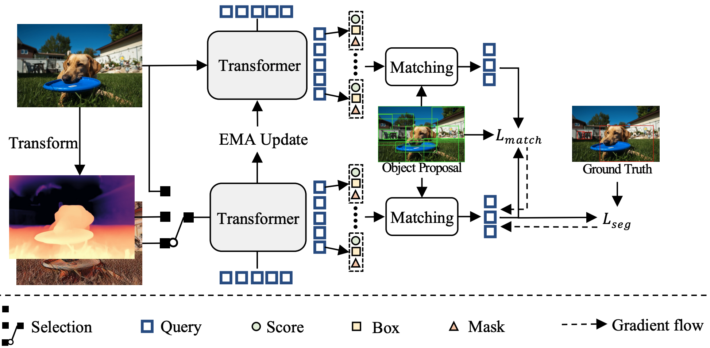

# ***v***-CLR
**<center><font size=4>[CVPR 2025 highlight] ***v***-CLR: View-Consistent Learning for Open-World Instance Segmentation </font></center>**  
[Chang-Bin Zhang](https://zhangchbin.github.io)<sup>1</sup>, Jinhong Ni<sup>1</sup>, Yujie Zhong<sup>2</sup>, Kai Han<sup>1</sup>  
<sup>1</sup> <sub>The University of Hong Kong</sub>  
<sup>2</sup> <sub>Meituan Inc.</sub>  

[]()
[](https://arxiv.org/abs/2504.01383)
[](https://visual-ai.github.io/vclr/)
<a href="mailto: zhangchbin@gmail.com">
        
    </a>


## Updates
- [04/25] We release the [HuggingFace Demo](https://huggingface.co/spaces/allencbzhang/vCLR).
- [04/25] We release the code, [datasets]() and [weights](https://huggingface.co/allencbzhang/vCLR/tree/main) of ***v***-CLR.
- [04/25] ***v***-CLR is selected as a highlight by CVPR 2025.
- [03/25] ***v***-CLR is accepted by CVPR 2025.


## Method



## Model Zoo
| Setting |   | Box AR<sub>10</sub> | Box AR<sub>100</sub> | Mask AR<sub>10</sub> | Mask AR<sub>10</sub> |
| :---: | :---: | :---: | :---: | :---: | :---: |
| VOC $\rightarrow$ NonVOC | [Config](projects/vCLR_deformable_mask/configs/dino-resnet/deformable_train_voc_eval_nonvoc.py) & [Weights](https://huggingface.co/allencbzhang/vCLR/resolve/main/vCLR_deformable_train_on_voc.pth) | 22.2 | 40.3 | 19.6 | 33.7 |
| COCO $\rightarrow$ LVIS | [Config](projects/vCLR_deformable_mask/configs/dino-resnet/deformable_train_coco_eval_lvis.py) & [Weights](https://huggingface.co/allencbzhang/vCLR/resolve/main/vCLR_deformable_train_on_coco.pth) | 20.3 | 45.8 | 16.1 | 34.6 |


## Environment Setup
- This repository is based on the Detrex framework.
- Python $\ge$ 3.7 and PyTorch $\ge$ 1.10 are required.  
- First, clone ```v-CLR``` repository.
```
git clone https://github.com/Visual-AI/vCLR.git
cd vCLR
```
- Second, install ```detectron2``` and ```detrex```
```
pip install -e detectron2
pip install -r requirements.txt
pip install -e .
```

- If you encounter any ```compilation error of cuda runtime```, you may try to use
```
export CUDA_HOME=<your_cuda_path>
```

- You may download images and annoations besides COCO from [OWIS Datasets](https://huggingface.co/datasets/allencbzhang/OWIScollection), and then organize the data as:
```
datasets/
├── coco2017/
│   │
│   ├── annotations/                  
│   │   ├── instances_train2017.json  
│   │   └── instances_val2017.json    
│   │
│   ├── train2017/                    
│   │   └── ...
│   │
│   └── val2017/                   
│       └── ...
│
├── object365_val/
│   └── ...
│
├── lvis_val/
│   └── ...
│
├── openworld_lvis_noncoco_val_correct.json
├── openworld_objects365_noncoco_val.json
├── uvo_nonvoc_val_rle.json
├── vCLR_coco_train2017_top5.json
├── vCLR_voc_train2017_top10.json
│
├── style_coco_train2017/
│   └── ...
│
├── train2017_depth_cmap/
│   └── ...
│
└── uvo_videos_dense_frames/
    └── ... 
```


## Train
- Train on VOC classes:
```
python projects/train_net.py \
    --config-file projects/vCLR_deformable_mask/configs/dino-resnet/deformable_train_voc_eval_nonvoc.py \
    --num-gpus N \
    dataloader.train.total_batch_size=8 \
    train.output_dir=<output_dir> \
    model.num_queries=2000 \ # similar performance when more than 1000
    train.amp.enabled=True \ # mixed precision training
    model.transformer.encoder.use_checkpoint=True \ # gradient checkpointing, save gpu memory but lower speed
    train.init_checkpoint=detectron2/dino_RN50_pretrain_d2_format.pkl \ # NOTE training from scratch is better for baseline model
```

- Train on COCO classes:
```
python projects/train_net.py \
    --config-file projects/vCLR_deformable_mask/configs/dino-resnet/deformable_train_coco_eval_lvis.py \
    --num-gpus N \
    dataloader.train.total_batch_size=8 \
    train.output_dir=<output_dir> \
    model.num_queries=2000 \ # similar performance when more than 1000
    train.amp.enabled=True \ # mixed precision training
    model.transformer.encoder.use_checkpoint=True \ # gradient checkpointing, save gpu memory but lower speed
    train.init_checkpoint=detectron2/dino_RN50_pretrain_d2_format.pkl \ # NOTE training from scratch is better for baseline model
```

## Evaluate
- Evaluate on Non-VOC or LVIS:
```
python projects/train_net.py \
    --config-file <config_file> \
    --eval-only \
    --num-gpus=4 \
    train.init_checkpoint=<checkpoint_path> \
    train.model_ema.use_ema_weights_for_eval_only=True \
    dataloader.test.dataset.names="openworld_nonvoc_classes_val2017" or "openworld_LVIS_noncoco_val2017" \
```

- Evaluate on UVO:
```
python projects/train_net.py \
    --config-file <config_file> \
    --eval-only \
    --num-gpus=4 \
    train.init_checkpoint=<checkpoint_path> \
    train.model_ema.use_ema_weights_for_eval_only=True \
    dataloader.test.dataset.names="openworld_uvo_nonvoc_val2017" \
    dataloader.train.mapper.instance_mask_format='bitmask' \
```

- Evaluate on Objects365:
```
python projects/train_net.py \
    --config-file <config_file> \
    --eval-only \
    --num-gpus=4 \
    train.init_checkpoint=<checkpoint_path> \
    train.model_ema.use_ema_weights_for_eval_only=True \
    dataloader.test.dataset.names="openworld_objects365_noncoco_val2017" \
    dataloader.train.mapper.mask_on=False \
```

## Citation
```
@inproceedings{zhang2024vclr,
  title={v-CLR: View-Consistent Learning for Open-World Instance Segmentation},
  author={Zhang, Chang-Bin and Ni, Jinhong and Zhong, Yujie and Han, Kai},
  booktitle={Proceedings of the IEEE/CVF Conference on Computer Vision and Pattern Recognition},
  year={2025}
}
```


